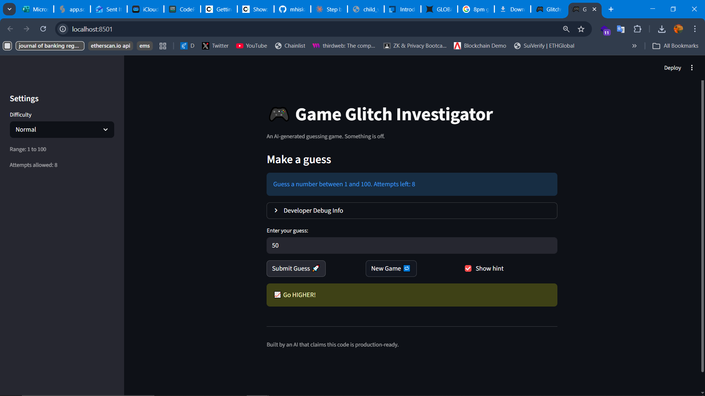
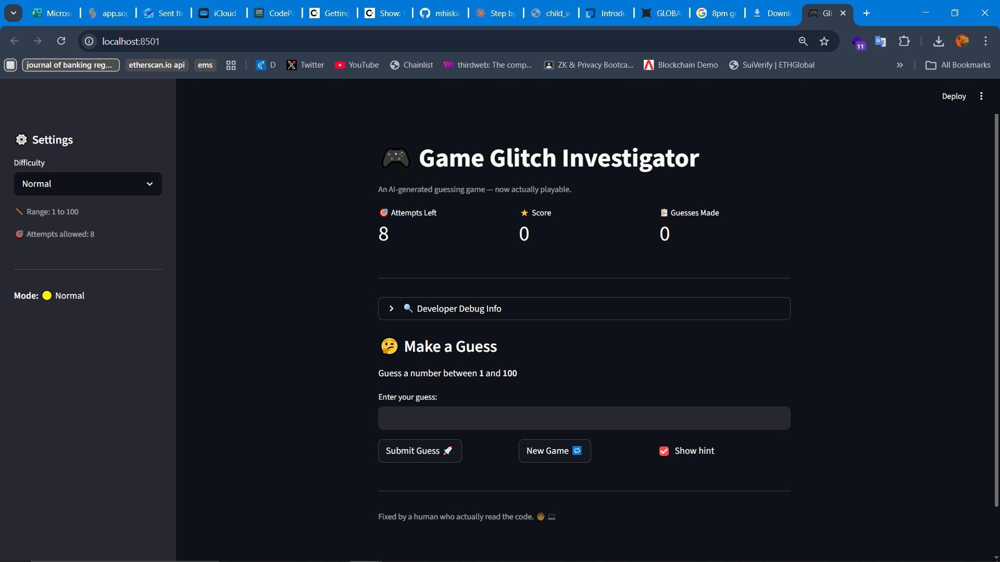

# 🎮 Game Glitch Investigator: The Impossible Guesser

## 🚨 The Situation

You asked an AI to build a simple "Number Guessing Game" using Streamlit.
It wrote the code, ran away, and now the game is unplayable.

- You can't win.
- The hints lie to you.
- The secret number seems to have commitment issues.

## 🛠️ Setup

1. Install dependencies: `pip install -r requirements.txt`
2. Run the fixed app: `python -m streamlit run app.py`

## 🕵️‍♂️ Your Mission

1. **Play the game.** Open the "Developer Debug Info" tab in the app to see the secret number. Try to win.
2. **Find the State Bug.** Why does the secret number change every time you click "Submit"? Ask ChatGPT: *"How do I keep a variable from resetting in Streamlit when I click a button?"*
3. **Fix the Logic.** The hints ("Higher/Lower") are wrong. Fix them.
4. **Refactor & Test.**
   - Move the logic into `logic_utils.py`.
   - Run `pytest` in your terminal.
   - Keep fixing until all tests pass!

## 📝 Document Your Experience

- [x] **Game Purpose:** This is a number guessing game where the player tries to guess a secret number within a limited number of attempts. The game gives hints after each guess telling you whether to go higher or lower, and awards points based on how quickly you find the answer.

- [x] **Bugs Found:**
  1. **Backwards hints** — `check_guess()` in `app.py` had the "Too High" and "Too Low" messages swapped, so guessing too high told you to go higher, making the game unwinnable.
  2. **String comparison bug** — On every even-numbered attempt, `app.py` converted the secret number to a string before comparing it, causing the equality check to fail even when the guess was correct.
  3. **Score rewarded wrong guesses** — `update_score()` gave +5 points on even attempts when the player guessed "Too High", meaning players were rewarded for being wrong.
  4. **Attempt counter started at 1** — `st.session_state.attempts` was initialized to `1` instead of `0`, so the first guess incorrectly showed one fewer attempt remaining than it should have.

- [x] **Fixes Applied:**
  1. Swapped the hint messages in `check_guess()` so "Too High" correctly tells the player to go lower and "Too Low" tells them to go higher.
  2. Removed the string conversion logic in `app.py` and updated `check_guess()` in `logic_utils.py` to always cast both values to `int` before comparing.
  3. Simplified `update_score()` to deduct 5 points for any wrong guess regardless of attempt number, removing the broken bonus point logic.
  4. Changed `st.session_state.attempts` initialization from `1` to `0` and moved the increment to only trigger on valid guesses.
  5. Refactored all four core functions (`get_range_for_difficulty`, `parse_guess`, `check_guess`, `update_score`) out of `app.py` and into `logic_utils.py`, then updated `app.py` to import from there.
  6. Added `conftest.py` to the project root so `pytest` can correctly locate `logic_utils` when running tests from the `tests/` folder.

## 📸 Demo

- [ ] []

## 🚀 Stretch Features

- [ ] []